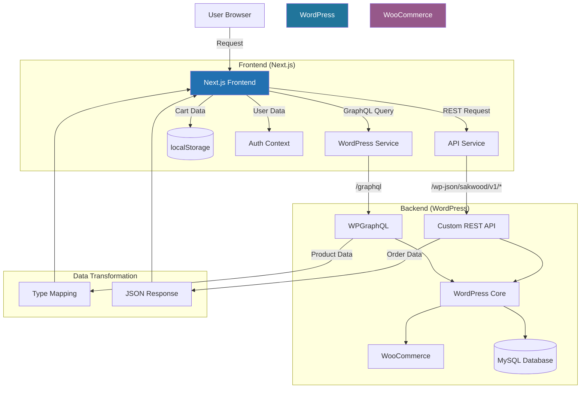
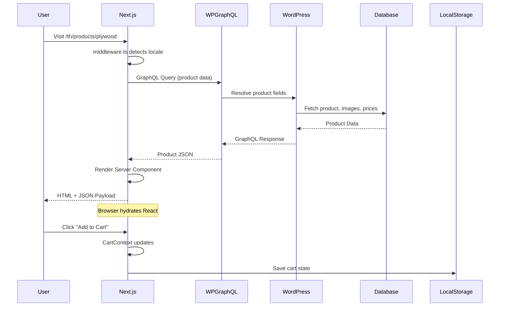
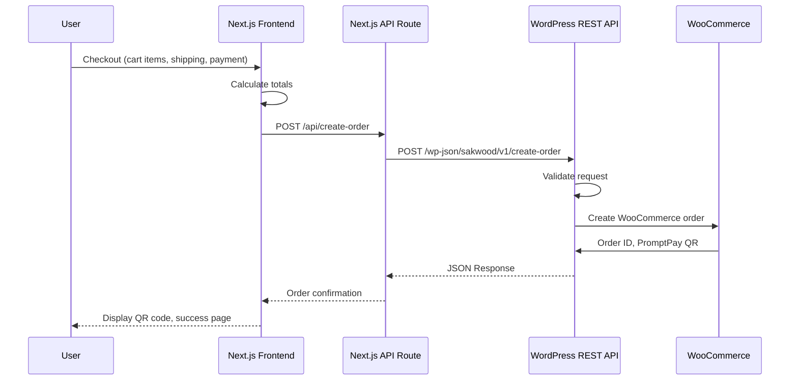

# Sakwood System Manual

**Document Type**: Complete System Guide
**Last Updated**: 2025-01-23
**Audience**: Developers, Technical Leads, Project Stakeholders
**Version**: 1.0.0

---

## Table of Contents

1. [System Introduction](#1-system-introduction)
2. [Agent Team Overview](#2-agent-team-overview)
3. [Development Workflows](#3-development-workflows)
4. [Architecture & Data Flow](#4-architecture--data-flow)
5. [Getting Started](#5-getting-started)
6. [Best Practices](#6-best-practices)

---

## 1. System Introduction

### 1.1 What is Sakwood?

**Sakwood** is a modern headless e-commerce platform built for selling premium wood products in Thailand. It combines the content management capabilities of WordPress with the performance and developer experience of Next.js 16.

### 1.2 Architecture Overview

The system follows a **Headless CMS** pattern:

```
┌─────────────────────────────────────────────────────────────┐
│                     USER BROWSER                             │
│  ┌─────────────────────────────────────────────────────┐   │
│  │         Next.js 16 Frontend (React 19)              │   │
│  │  • App Router with locale routing (th/en)           │   │
│  │  • Server Components for performance               │   │
│  │  • Client Components for interactivity              │   │
│  │  • Tailwind CSS + shadcn/ui components             │   │
│  └───────────────────┬─────────────────────────────────┘   │
│                      │                                       │
└──────────────────────┼───────────────────────────────────────┘
                       │ GraphQL / REST API
                       ▼
┌─────────────────────────────────────────────────────────────┐
│              WordPress Backend (Docker)                      │
│  ┌─────────────────────────────────────────────────────┐   │
│  │  • WooCommerce (Product & Order Management)         │   │
│  │  • WPGraphQL (Content API)                          │   │
│  │  • Custom REST API (E-commerce operations)          │   │
│  │  • Custom Plugin (Sakwood Integration)             │   │
│  └─────────────────────────────────────────────────────┘   │
└─────────────────────────────────────────────────────────────┘
```

### 1.3 Why This Architecture?

| Benefit | Description |
|---------|-------------|
| **Performance** | Next.js Server Components render initial HTML on the server for fast page loads |
| **Flexibility** | WordPress manages content and products while Next.js handles the frontend experience |
| **Scalability** | Frontend can be deployed to edge networks (Vercel, Cloudflare) independently |
| **Developer Experience** | TypeScript, strict mode, and modern React patterns improve code quality |
| **SEO** | Server-side rendering ensures search engines can index all content |
| **Internationalization** | Built-in Thai/English support with locale routing |

### 1.4 Technology Stack

**Frontend:**
- Next.js 16 (App Router)
- React 19
- TypeScript 5.x
- Tailwind CSS
- shadcn/ui components

**Backend:**
- WordPress 6.x
- WooCommerce
- WPGraphQL
- Custom plugin (`sakwood-integration`)

**Development:**
- Docker (WordPress dev environment)
- Node.js 18+
- npm/pnpm

---

## 2. Agent Team Overview

This project uses a team of specialized AI agents to handle different aspects of development. Each agent has a specific role and expertise.

### 2.1 Agent Reference Table

| Agent | Purpose | When to Use | Model |
|-------|---------|-------------|-------|
| **@feature-orchestrator** | Manages complete feature lifecycle from planning through implementation | Building new features (product comparison, wishlist, reviews, etc.) | Sonnet |
| **@nextjs-wpgraphql-builder** | Builds type-safe Next.js components that consume WordPress GraphQL data | Creating product displays, blog layouts, any UI fetching from WPGraphQL | Sonnet |
| **@nextjs-debugger** | Diagnoses and fixes Next.js 16 hydration errors, API failures, caching issues | Encountering hydration errors, API failures, server-client mismatches | Sonnet |
| **@code-quality-auditor** | Reviews code for security, performance, SEO, and accessibility compliance | Before production deployment, after significant changes, when requested | Sonnet |
| **@docs-writer** | Creates and maintains technical documentation, onboarding guides, and tutorials | Documenting new features, onboarding developers, creating workflow guides | Opus |
| **@orchestrator** | Automatic workflow manager that runs Planner → Developer → Reviewer → Debugger chain | Quick feature builds using waterfall process without manual intervention | Sonnet |

### 2.2 Agent Workflows

```
┌─────────────────────────────────────────────────────────────┐
│                    WORKFLOW PATTERNS                         │
└─────────────────────────────────────────────────────────────┘

1. FEATURE DEVELOPMENT (Structured)
   User Request → @feature-orchestrator
   ├── Blueprint Phase (Planner)
   ├── Tickets Phase (Manager)
   └── Code Phase (Developer)

2. QUICK COMPONENT BUILD
   User Request → @nextjs-wpgraphql-builder
   └── Direct code generation with type safety

3. ISSUE RESOLUTION
   Error Report → @nextjs-debugger
   ├── Diagnosis
   ├── Root Cause Analysis
   └── Solution Implementation

4. QUALITY ASSURANCE
   Code Ready → @code-quality-auditor
   ├── Security Review
   ├── Architecture Check
   ├── SEO Audit
   └── Accessibility Review

5. AUTOMATIC PIPELINE
   User Request → @orchestrator
   ├── 1. Planning Phase
   ├── 2. Building Phase
   ├── 3. Review Phase
   └── 4. Final Check Phase
```

### 2.3 Agent Handoffs

Agents work together by handing off tasks:

1. **@feature-orchestrator** → **@nextjs-debugger**
   - After implementing a complex feature, debugger verifies no hydration issues

2. **@nextjs-wpgraphql-builder** → **@code-quality-auditor**
   - After building components, auditor reviews for security and a11y

3. **@orchestrator** → **@docs-writer**
   - After feature completion, documentation is created

---

## 3. Development Workflows

### 3.1 Tech Lead → Developer Workflow

This workflow is used when building new features with proper planning and implementation phases.

#### Phase 1: Planning (Tech Lead / @feature-orchestrator)

**Goal**: Define complete data architecture before writing code.

**Steps**:

1. **Define WordPress ACF Fields**
   ```php
   // Example: Product Comparison Feature
   - Field Group: Product Comparison Settings
     - Checkbox: Enable comparison (default: true)
     - Number: Max products to compare (default: 4)
     - Repeater: Comparison fields
       * Field label
       * Field name
       * Field type (price, dimensions, material, etc.)
   ```

2. **Design GraphQL Schema**
   ```graphql
   type Product {
     id: ID!
     name: String!
     price: String!
     comparisonFields: [ComparisonField!]
   }
   ```

3. **Plan Routing Strategy**
   ```
   - Route: /th/compare or /en/compare
   - Static generation with revalidation
   - Query params for product IDs
   - Locale handling for Thai/English
   ```

4. **Identify REST API Endpoints** (if needed)
   ```
   POST /wp-json/sakwood/v1/compare/add
   POST /wp-json/sakwood/v1/compare/remove
   GET  /wp-json/sakwood/v1/compare/products
   ```

**Output**: Blueprint document with:
- ACF field definitions
- GraphQL schema
- Route structure
- API endpoint specifications

#### Phase 2: Task Breakdown (Project Manager / @feature-orchestrator)

**Goal**: Create actionable implementation tasks.

**Backend Tasks (WordPress Plugin)**:
- [ ] Register ACF field group in PHP
- [ ] Create REST API endpoint handler
- [ ] Add GraphQL field resolvers
- [ ] Implement WordPress hooks

**Frontend Tasks (Next.js)**:
- [ ] Define TypeScript interfaces
- [ ] Create service layer
- [ ] Write GraphQL queries
- [ ] Build React components
- [ ] Create page/route
- [ ] Add translations

**Output**: Task list with complexity estimates and dependencies.

#### Phase 3: Implementation (Developer / @feature-orchestrator)

**Goal**: Write production-ready code.

**Example: Product Comparison Feature**

1. **WordPress Plugin PHP**:
   ```php
   // Register ACF field group
   add_action('acf/init', 'register_product_compare_fields');
   ```

2. **TypeScript Interfaces**:
   ```typescript
   interface ComparisonProduct {
     databaseId: number;
     name: string;
     price: string;
     [key: string]: string | number;
   }
   ```

3. **Service Layer**:
   ```typescript
   export async function getComparisonProducts(ids: number[]) {
     const query = `...`;
     return fetchGraphQL(query);
   }
   ```

4. **React Component**:
   ```typescript
   'use client';
   export function ProductComparison({ products }: Props) {
     return <table>...</table>;
   }
   ```

5. **Translations**:
   ```json
   // en.json & th.json
   "compare": { "add_to_compare": "Add to Compare" }
   ```

**Quality Checklist**:
- [ ] No `any` types
- [ ] Proper null checks
- [ ] AbortController for polling
- [ ] No console.log statements
- [ ] Responsive design
- [ ] SSR-safe patterns

### 3.2 Quick Component Build Workflow

For simple UI components that fetch WordPress data:

```
User Request → @nextjs-wpgraphql-builder
              ↓
         1. Analyze Requirements
         2. Define Types (TypeScript)
         3. Write GraphQL Query
         4. Build Component (Server/Client)
         5. Test Edge Cases
```

**Example**: Create a product card component

```typescript
// 1. Define Types
interface Product {
  databaseId: number;
  name: string;
  price: string;
  image?: MediaItem;
}

// 2. GraphQL Query
const GET_PRODUCT = gql`
  query GetProduct($id: ID!) {
    product(id: $id) {
      databaseId
      name
      price
      image { sourceUrl altText }
    }
  }
`;

// 3. Server Component
export default async function ProductCard({ id }: Props) {
  const data = await fetchGraphQL<ProductData>(GET_PRODUCT, { id });
  const product = data?.product;

  return (
    <div className="border rounded p-4">
      <h3>{product?.name}</h3>
      <p>{product?.price}</p>
    </div>
  );
}
```

### 3.3 Debugging Workflow

```
Error Report → @nextjs-debugger
            ↓
      1. Gather Error Info
      2. Reproduce Issue
      3. Isolate Root Cause
      4. Provide Solution
      5. Prevention Tips
```

**Common Issues**:

| Issue Type | Root Cause | Solution |
|------------|------------|----------|
| Hydration Error | localStorage accessed before mount | Use mounted state pattern |
| API Failure | Wrong endpoint URL | Verify `/wp-json/sakwood/v1/*` |
| Missing Images | Null image nodes | Add fallback image |
| Thai Search | Spaces in query | Remove spaces before search |

### 3.4 Documentation Workflow

```
Feature Complete → @docs-writer
                ↓
          1. Analyze Feature
          2. Write Overview
          3. Create Tutorial
          4. Add Diagrams
          5. Review & Publish
```

---

## 4. Architecture & Data Flow

### 4.1 Data Flow Diagram



### 4.2 Request Flow: Product Page



### 4.3 Order Creation Flow



### 4.4 Component Architecture

```
app/
├── [lang]/
│   ├── (auth)/
│   │   ├── login/
│   │   └── register/
│   ├── (shop)/
│   │   ├── products/
│   │   │   └── [slug]/          ← Server Component (fetches product)
│   │   └── checkout/
│   │       └── page.tsx         ← Client Component (interactivity)
│   ├── account/
│   │   └── page.tsx             ← Auth Context provider
│   └── page.tsx                 ← Homepage

components/
├── ui/                           ← Reusable UI primitives
│   ├── button.tsx
│   ├── card.tsx
│   └── ...
├── layout/                       ← Layout components
│   ├── header.tsx                ← Client (menu toggle, cart)
│   ├── footer.tsx                ← Server (static)
│   └── breadcrumbs.tsx
├── products/                     ← Feature components
│   ├── ProductCard.tsx           ← Server (from GraphQL)
│   ├── ProductCompare.tsx        ← Client (state management)
│   └── QuickView.tsx            ← Client (modal)
└── cart/
    ├── CartItems.tsx            ← Client (localStorage)
    └── CartSummary.tsx          ← Server (calculations)

lib/
├── graphql/
│   └── queries.ts               ← GraphQL query definitions
├── services/
│   ├── wordpressService.ts      ← GraphQL client
│   ├── woocommerceService.ts    ← Order API
│   └── productService.ts        ← Product CRUD
├── context/
│   ├── CartContext.tsx          ← Cart state
│   └── AuthContext.tsx          ← User auth state
└── types/
    └── dictionary.ts            ← Translation types
```

---

## 5. Getting Started

### 5.1 First-Time Setup

**Prerequisites**:
- Docker Desktop installed
- Node.js 18+ installed
- Git installed

**Step 1: Clone Repository**
```bash
git clone <repository-url>
cd sakwood/sakwood-wp
```

**Step 2: Start WordPress Backend**
```bash
docker-compose up -d
```

Access WordPress at: http://localhost:8006/wp-admin

**Step 3: Install Frontend Dependencies**
```bash
cd frontend
npm install
```

**Step 4: Configure Environment**
Create `frontend/.env.local`:
```env
NEXT_PUBLIC_WORDPRESS_GRAPHQL_URL=http://localhost:8006/graphql
NEXT_PUBLIC_WORDPRESS_API_URL=http://localhost:8006/wp-json/sakwood/v1
```

**Step 5: Start Development Server**
```bash
npm run dev
```

Access frontend at: http://localhost:3000

### 5.2 Development Workflow

**1. Make Backend Changes (WordPress)**:
```bash
# Edit plugin files in wordpress-plugin/sakwood-integration/
# Copy changes to Docker container
docker cp wordpress-plugin/sakwood-integration/updated-file.php sak_wp:/var/www/html/wp-content/plugins/sakwood-integration/

# Or restart to mount changes
docker-compose restart
```

**2. Make Frontend Changes (Next.js)**:
```bash
# Edit files in frontend/
# Next.js auto-reloads in browser
```

**3. Test Integration**:
- Verify GraphQL queries in GraphiQL: http://localhost:8006/graphql
- Test REST endpoints: `curl http://localhost:8006/wp-json/sakwood/v1/products`
- Check browser console for errors

### 5.3 Creating a New Feature

**Option 1: Use @feature-orchestrator (Recommended)**
```
Request: "I need a product comparison feature"
→ @feature-orchestrator handles entire lifecycle
```

**Option 2: Manual Workflow**
```
1. Plan → Create blueprint
2. Build → Write code
3. Test → Verify functionality
4. Review → Quality check
```

**Option 3: Quick Build**
```
Request: "Create a blog post card component"
→ @nextjs-wpgraphql-builder builds component directly
```

---

## 6. Best Practices

### 6.1 Code Quality

**TypeScript**:
- ✅ Always define interfaces for WordPress data
- ✅ Use optional chaining: `data?.product?.title`
- ✅ Avoid `any` types
- ✅ Export types for reuse

**React Components**:
- ✅ Use Server Components by default
- ✅ Only add `'use client'` for interactivity
- ✅ Follow mounted state pattern for localStorage
- ✅ Clean up effects with return functions

**Error Handling**:
- ✅ Try-catch in service functions
- ✅ Return `{ success, data, error }` objects
- ✅ Display user-friendly error messages
- ✅ Log errors with console.error

### 6.2 Performance

**GraphQL Queries**:
- ✅ Request only needed fields
- ✅ Use fragments for reusability
- ✅ Implement caching strategies

**Next.js**:
- ✅ Use Server Components for static content
- ✅ Implement ISR for semi-static data
- ✅ Never cache user-specific data

**Images**:
- ✅ Use next/image for all images
- ✅ Provide width/height for CLS prevention
- ✅ Lazy-load image galleries

### 6.3 Internationalization

**Translations**:
- ✅ Add keys to both `en.json` and `th.json`
- ✅ Update `Dictionary` interface
- ✅ Use parameterized strings for dynamic content

**Thai Language**:
- ✅ Remove spaces in search queries for better matching
- ✅ Test with actual Thai text
- ✅ Consider font rendering differences

### 6.4 Security

**WordPress Backend**:
- ✅ Sanitize all inputs
- ✅ Validate user capabilities
- ✅ Use nonce for AJAX
- ✅ Escape output with `esc_html()`, `esc_attr()`

**Next.js Frontend**:
- ✅ Sanitize HTML from WordPress (use DOMPurify if needed)
- ✅ Never expose sensitive data in client code
- ✅ Validate data before rendering

### 6.5 Accessibility

**Components**:
- ✅ Alt text for all images
- ✅ Semantic HTML (h1-h6, nav, main, footer)
- ✅ Keyboard navigation
- ✅ ARIA labels for interactive elements

**Forms**:
- ✅ Label all inputs
- ✅ Error announcements
- ✅ Focus management in modals

---

## Appendix

### A. Quick Reference Commands

```bash
# WordPress
docker-compose up -d                    # Start WordPress
docker-compose down                     # Stop WordPress
docker logs sak_wp                      # View logs
docker exec -it sak_wp bash            # Access container

# Next.js
npm run dev                             # Development server
npm run build                           # Production build
npm run lint                            # Lint code

# Testing
curl http://localhost:8006/graphql      # Test GraphQL
curl http://localhost:8006/wp-json/sakwood/v1/products  # Test REST
```

### B. File Structure Quick Reference

```
frontend/
├── app/[lang]/...                     # Pages with locale routing
├── components/...                     # React components
├── lib/
│   ├── graphql/queries.ts            # GraphQL queries
│   ├── services/...                  # API services
│   └── context/...                   # React contexts
└── dictionaries/{en,th}.json        # Translations

wordpress-plugin/sakwood-integration/
├── templates/                        # Admin templates
├── assets/                           # CSS/JS assets
└── *.php                             # Plugin files
```

### C. Agent Contact Examples

```
# Build a new feature
"Use @feature-orchestrator to build a wishlist feature"

# Create a component
"Use @nextjs-wpgraphql-builder to create a product grid"

# Debug an issue
"Use @nextjs-debugger to fix this hydration error"

# Review code
"Use @code-quality-auditor to review this component"

# Document feature
"Use @docs-writer to document the CRM system"

# Quick pipeline
"Use @orchestrator to build a newsletter signup"
```

---

**Document End**

For questions or updates, contact the development team or create an issue in the repository.
