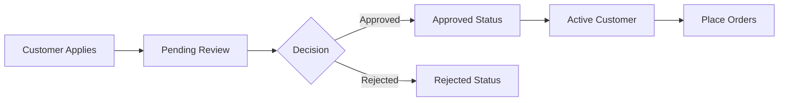

# Wholesale Customer Management User Manual

**Document Type:** User Manual
**Last Updated:** 2026-01-28
**Audience:** Sales administrators, account managers
**Prerequisites:** WordPress Admin access, Wholesale Manager role

## Table of Contents

1. [Overview](#overview)
2. [Accessing Wholesale Applications](#accessing-wholesale-applications)
3. [Application Workflow](#application-workflow)
4. [Reviewing Applications](#reviewing-applications)
5. [Approving Applications](#approving-applications)
6. [Rejecting Applications](#rejecting-applications)
7. [Managing Customer Status](#managing-customer-status)
8. [Bulk Actions](#bulk-actions)
9. [Troubleshooting](#troubleshooting)

## Overview

The Wholesale Management system handles B2B customer applications for special pricing and terms. Wholesale customers receive 15% discount on all products with Net-30 payment terms.

### Wholesale Customer Benefits

| Benefit | Details |
|---------|---------|
| **Discount** | 15% off all products |
| **Payment Terms** | Net-30 (30 days to pay) |
| **Credit Limit** | Configurable per customer |
| **Dedicated Support** | Priority customer service |

### Application Workflow



### Status Definitions

| Status | Meaning | Next Action |
|--------|---------|-------------|
| **Pending** | Application submitted, awaiting review | Review application |
| **Approved** | Approved but not yet active | Activate customer account |
| **Active** | Fully approved, can place orders | Monitor orders |
| **Rejected** | Application declined | (No action - customer can reapply) |

## Accessing Wholesale Applications

### Step 1: Navigate to Wholesale Section

1. Log in to WordPress Admin
2. In the left sidebar, click **Wholesale**

```
Wholesale > All Applications
```

### Step 2: Application Menu

The Wholesale section has three sub-pages:

| Menu Item | Description |
|-----------|-------------|
| **All Applications** | View all applications regardless of status |
| **Pending** | Only pending applications (requires action) |
| **Approved** | Approved applications (for review) |

### Step 3: Application List

The list displays:

| Column | Description |
|--------|-------------|
| **ID** | Database reference number |
| **Application ID** | Unique reference (e.g., WSL-xxxxxxxx) |
| **Company** | Registered company name |
| **Contact** | Applicant name and email |
| **Status** | Current application status |
| **Date** | Application submission date |
| **Credit Limit** | Requested credit amount |

## Application Workflow

### Customer Application Process

1. **Customer registers** on the website
2. **Completes wholesale form** with:
   - Company information
   - Tax ID
   - Business address
   - Estimated monthly volume
3. **Application submitted** - Status: Pending
4. **Admin reviews** - You take action here
5. **Decision made** - Approve or Reject
6. **Notification sent** - Customer receives email

### Information Provided by Applicants

| Field | Description |
|-------|-------------|
| **Company Name** | Legal business name |
| **Tax ID** | Thai tax identification number |
| **Business Address** | Registered business address |
| **Contact Person** | Name and contact details |
| **Phone** | Business phone number |
| **Monthly Volume** | Estimated purchase amount |
| **Business Type** | Construction, retail, manufacturing, etc. |

## Reviewing Applications

### Step 1: Open Application

1. From the application list, click on:
   - **Application ID** link OR
   - **Company name**
2. Application detail page opens

### Step 2: Review Application Details

Check the following sections:

**Business Information:**
- Company name and registration
- Tax ID validity
- Business address

**Contact Details:**
- Contact person name
- Email and phone
- Website (if provided)

**Application Content:**
- Monthly volume estimate
- Business type
- Additional notes

**Customer History:**
- Previous orders (if existing customer)
- Account history
- Payment history

### Step 3: Make Decision

Based on review, decide to:
- **Approve** - Accept application
- **Reject** - Decline application
- **Request More Info** - Contact applicant (manual)

## Approving Applications

### Individual Approval

1. Open application detail page
2. Review all information
3. Set credit limit (if different from requested)
4. Click **Approve Application**
5. Enter optional notes
6. Confirm approval

### Approval Actions

When approved:

| Action | Description |
|--------|-------------|
| **Status Update** | Changed to "Approved" |
| **Credit Limit** | Set based on your input (default: 50,000 THB) |
| **User Role** | Changed to "wholesale" |
| **Email Sent** | Notification sent to customer |

### Credit Limit Guidelines

| Business Size | Suggested Credit Limit |
|---------------|----------------------|
| Small (under 50k/month) | 30,000 - 50,000 THB |
| Medium (50k-200k/month) | 50,000 - 100,000 THB |
| Large (200k+/month) | 100,000 - 500,000 THB |

**Factors to Consider:**
- Business registration length
- Industry reputation
- Payment history (if existing customer)
- Reference checks

### Post-Approval Setup

After approval, the customer can:

1. Log in with wholesale account
2. See discounted prices (15% off)
3. Select Net-30 payment option
4. Place orders with credit terms

**No additional setup required** - approval activates everything automatically.

## Rejecting Applications

### Individual Rejection

1. Open application detail page
2. Click **Reject Application**
3. Enter reason for rejection (required)
4. Click **Confirm Rejection**

### Rejection Reasons

Common reasons for rejection:

| Reason | Explanation |
|--------|-------------|
| **Incomplete Information** | Missing or incorrect details provided |
| **Insufficient Business History** | New business without track record |
| **Low Volume Estimate** | Volume below wholesale threshold |
| **Location Outside Service Area** | Cannot deliver to location |
| **Payment Issues** | History of late payments (if existing customer) |

### Rejection Email

The customer receives an email stating:

```
Thank you for your interest in our wholesale program.

Unfortunately, we are unable to approve your application at this time.
This decision may be due to various factors including business verification,
estimated volume, or current capacity.

We encourage you to apply again in the future.

If you have questions, please contact our support team.
```

### Re-Application

Rejected customers can:
- Apply again after 90 days
- Contact support for clarification
- Update business information and reapply

## Managing Customer Status

### Viewing Active Customers

1. Navigate to **Users** > **All Users**
2. Filter by role: **Wholesale**
3. View all active wholesale customers

### Customer Information

For each wholesale customer, you can view:

| Information | Location |
|-------------|----------|
| **Orders** | WooCommerce > Orders > Filter by customer |
| **Credit Status** | User profile > Wholesale options |
| **Payment History** | Individual order details |

### Adjusting Credit Limits

To change credit limit:

1. Go to **Users** > All Users
2. Click on customer name
3. Scroll to **Wholesale Options** section
4. Update **Credit Limit** field
5. Click **Update User**

### Suspending Wholesale Status

To suspend wholesale privileges:

1. Edit user profile
2. Change **Role** from "Wholesale" to "Customer"
3. Optionally add notes explaining suspension
4. Click **Update User**

**Note:** Suspended customers lose wholesale pricing and credit terms.

## Bulk Actions

### Bulk Approve

For approving multiple pending applications:

1. Go to **Wholesale** > **Pending**
2. Check boxes for applications to approve
3. Select **Approve** from Bulk Actions dropdown
4. Click **Apply**
5. Confirm action

**Caution:** Bulk approval uses default credit limit (50,000 THB) for all.

### Bulk Reject

For rejecting multiple applications:

1. Check boxes for applications to reject
2. Select **Reject** from Bulk Actions dropdown
3. Click **Apply**
4. Enter rejection reason
5. Confirm action

**Note:** All rejected applications receive the same rejection email.

## Troubleshooting

### Issue: Approval Not Working

**Possible Causes:**
- User account issue
- Database error

**Solutions:**
1. Check user exists in **Users** section
2. Verify user email is valid
3. Try manual role change: Edit user > Set role to Wholesale
4. Contact technical support if issue persists

### Issue: Customer Not Seeing Discount

**Possible Causes:**
- Not logged in
- Cache issue
- Role not properly assigned

**Solutions:**
1. Verify customer is logged in
2. Check user role is "Wholesale"
3. Clear website cache
4. Customer should log out and log back in

### Issue: Credit Limit Not Working

**Possible Causes:**
- Limit not set correctly
- Orders exceeding limit

**Solutions:**
1. Verify limit in user profile
2. Check limit is positive number
3. Consider increasing limit for good customers
4. Review order history for credit usage

### Issue: No Email Notifications

**Possible Causes:**
- Email settings misconfigured
- Email in spam folder

**Solutions:**
1. Check WordPress email settings
2. Verify SMTP is configured
3. Check spam/junk folders
4. Send test email from WordPress

## Tips and Best Practices

### Application Review

**Review Timeline:**
- Process applications within 2-3 business days
- Respond faster during peak seasons
- Set expectations with customers

**Verification:**
- Verify tax ID against government database
- Check business registration
- Call provided phone numbers for new businesses

**Documentation:**
- Keep notes on approval/rejection decisions
- Document reasons for reference
- Track approval patterns over time

### Credit Management

**Starting Limits:**
- Start conservative (30-50k THB)
- Increase based on payment history
- Review limits quarterly

**Monitoring:**
- Watch for late payments
- Check order frequency
- Adjust based on relationship

**Red Flags:**
- Consistently late payments
- Orders exceeding credit
- Declining order volume

### Customer Communication

**Approval:**
- Send welcome email with next steps
- Include contact information for support
- Explain ordering process

**Rejection:**
- Be clear but professional
- Provide actionable feedback
- Leave door open for future applications

---

**Related Manuals:**
- [Dealer Application System](./06-dealer-management.md) - Higher-tier dealer management
- [Customer Portal](./07-customer-portal.md) - Customer self-service features
