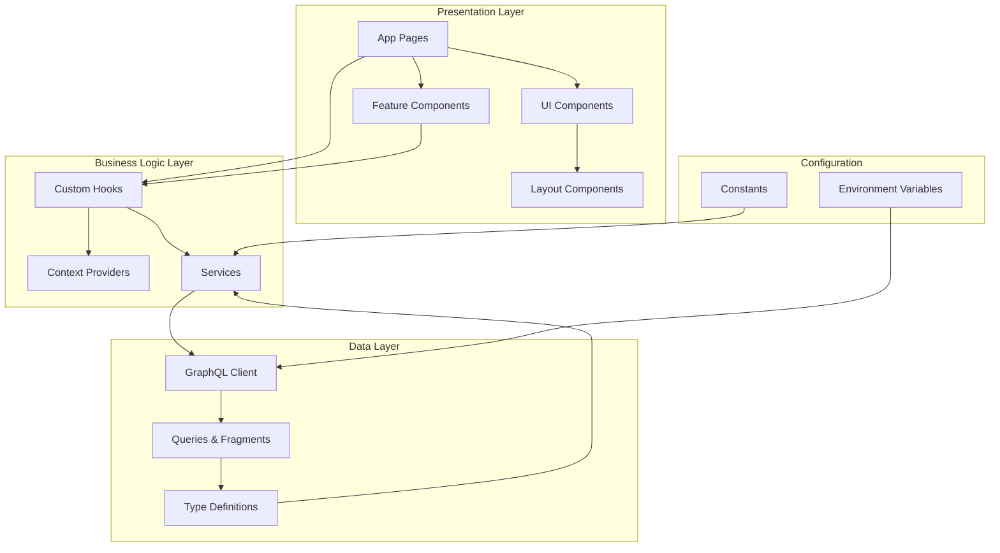

# Code Structure Improvement Plan

## Executive Summary

This document outlines a comprehensive plan to improve the code structure of the SAK WoodWorks Next.js frontend application. The current implementation has several areas for improvement including code organization, type safety, reusability, and maintainability.

## Current State Analysis

### Technology Stack
- Next.js 16.1.1 (App Router)
- React 19.2.3
- TypeScript 5
- Tailwind CSS v4
- GraphQL (WordPress/WooCommerce backend)

### Current File Structure
```
frontend/
├── app/
│   ├── favicon.ico
│   ├── globals.css
│   ├── layout.tsx
│   ├── page.tsx (homepage with inline data fetching)
│   └── products/
│       └── [slug]/
│           └── page.tsx (product detail with inline data fetching)
├── public/
├── package.json
├── tsconfig.json
├── next.config.ts
└── ...
```

### Identified Issues

1. **Configuration Management**
   - Hardcoded API endpoint `http://sak_wp:80/graphql` in multiple files
   - No environment variables setup
   - No centralized configuration

2. **Type Safety**
   - Using `any` types for product data
   - No TypeScript interfaces for GraphQL responses
   - Missing proper type definitions

3. **Code Organization**
   - Data fetching logic mixed with UI components
   - No separation of concerns
   - No component extraction or reusability

4. **GraphQL Management**
   - Queries inline in components
   - No query organization or fragments
   - No query constants

5. **Error Handling**
   - Basic try-catch only
   - No centralized error handling
   - No error boundary components

6. **UI/UX Gaps**
   - No loading states
   - No navigation component
   - No footer component
   - No cart/quote functionality
   - Default metadata not updated

7. **Next.js Configuration**
   - No image domain configuration for external images
   - Empty next.config.ts

## Proposed Architecture

### New File Structure

```
frontend/
├── app/
│   ├── (marketing)/
│   │   ├── layout.tsx (marketing layout with header/footer)
│   │   └── page.tsx (homepage)
│   ├── products/
│   │   ├── [slug]/
│   │   │   ├── loading.tsx
│   │   │   ├── error.tsx
│   │   │   └── page.tsx
│   │   └── page.tsx (products listing)
│   ├── cart/
│   │   └── page.tsx
│   ├── layout.tsx (root layout)
│   └── globals.css
├── components/
│   ├── ui/
│   │   ├── Button.tsx
│   │   ├── Card.tsx
│   │   ├── ProductCard.tsx
│   │   ├── Skeleton.tsx
│   │   └── ErrorBoundary.tsx
│   ├── layout/
│   │   ├── Header.tsx
│   │   ├── Footer.tsx
│   │   └── Navigation.tsx
│   └── features/
│       ├── ProductGrid.tsx
│       ├── ProductDetails.tsx
│       └── CartSummary.tsx
├── lib/
│   ├── graphql/
│   │   ├── queries.ts
│   │   ├── fragments.ts
│   │   └── client.ts
│   ├── services/
│   │   └── productService.ts
│   ├── types/
│   │   ├── product.ts
│   │   ├── api.ts
│   │   └── index.ts
│   ├── config/
│   │   └── constants.ts
│   └── utils/
│       ├── format.ts
│       └── validation.ts
├── context/
│   └── CartContext.tsx
├── hooks/
│   ├── useCart.ts
│   └── useProducts.ts
├── .env.local
├── .env.example
└── next.config.ts
```

### Architecture Diagram



## Detailed Implementation Plan

### Phase 1: Configuration & Types Foundation

#### 1.1 Environment Configuration
- Create `.env.example` file with all required variables
- Create `.env.local` for local development
- Add API endpoint, cache settings, and feature flags

#### 1.2 Constants Management
- Create `lib/config/constants.ts` for application-wide constants
- Define API endpoints, cache durations, pagination settings
- Centralize color scheme and theme values

#### 1.3 TypeScript Interfaces
- Create `lib/types/product.ts` for product-related types
- Create `lib/types/api.ts` for API response types
- Export all types from `lib/types/index.ts`

### Phase 2: Data Layer

#### 2.1 GraphQL Client
- Create `lib/graphql/client.ts` with reusable fetch wrapper
- Implement error handling and retry logic
- Add request/response interceptors

#### 2.2 Query Organization
- Create `lib/graphql/queries.ts` for all GraphQL queries
- Create `lib/graphql/fragments.ts` for reusable fragments
- Export typed query functions

#### 2.3 Service Layer
- Create `lib/services/productService.ts`
- Implement `getProducts()`, `getProductBySlug()`, etc.
- Add caching strategy support

### Phase 3: Component Architecture

#### 3.1 UI Components
- Create reusable `components/ui/Button.tsx` with variants
- Create `components/ui/Card.tsx` for consistent card styling
- Create `components/ui/Skeleton.tsx` for loading states
- Create `components/ui/ErrorBoundary.tsx` for error handling

#### 3.2 Feature Components
- Create `components/features/ProductCard.tsx` from page.tsx logic
- Create `components/features/ProductGrid.tsx` for grid layout
- Create `components/features/ProductDetails.tsx` for product details

#### 3.3 Layout Components
- Create `components/layout/Header.tsx` with navigation
- Create `components/layout/Footer.tsx` with site info
- Create `components/layout/Navigation.tsx` for menu items

### Phase 4: State Management

#### 4.1 Cart Context
- Create `context/CartContext.tsx` for cart state
- Implement add to cart, remove from cart, update quantity
- Persist cart to localStorage

#### 4.2 Custom Hooks
- Create `hooks/useCart.ts` for cart operations
- Create `hooks/useProducts.ts` for product data fetching
- Create `hooks/useLocalStorage.ts` for persistence

### Phase 5: Page Improvements

#### 5.1 Homepage Refactor
- Extract data fetching to service layer
- Use ProductCard and ProductGrid components
- Add loading skeleton
- Improve error handling

#### 5.2 Product Detail Refactor
- Extract data fetching to service layer
- Use ProductDetails component
- Add loading.tsx for streaming SSR
- Add error.tsx for error states

#### 5.3 New Pages
- Create products listing page with filters
- Create cart page
- Add about/contact pages if needed

### Phase 6: Configuration & Optimization

#### 6.1 Next.js Configuration
- Configure image domains for WordPress images
- Add rewrites for API proxy if needed
- Configure headers for caching

#### 6.2 Metadata & SEO
- Update root layout metadata
- Add dynamic metadata for product pages
- Implement structured data (JSON-LD)

#### 6.3 Performance
- Implement proper caching strategy
- Add image optimization
- Consider ISR for product pages

## Benefits of This Architecture

1. **Maintainability**
   - Clear separation of concerns
   - Single source of truth for types
   - Reusable components

2. **Type Safety**
   - Full TypeScript coverage
   - No more `any` types
   - Better IDE support

3. **Scalability**
   - Easy to add new features
   - Modular component structure
   - Clear data flow

4. **Developer Experience**
   - Better code organization
   - Clear file structure
   - Easier onboarding

5. **Performance**
   - Proper caching strategies
   - Loading states for better UX
   - Optimized images

## Implementation Order

The implementation should follow the phases in order:
1. Foundation (config, types)
2. Data layer
3. Components
4. State management
5. Page refactoring
6. Configuration & optimization

Each phase builds on the previous one, ensuring a stable foundation before adding complexity.
