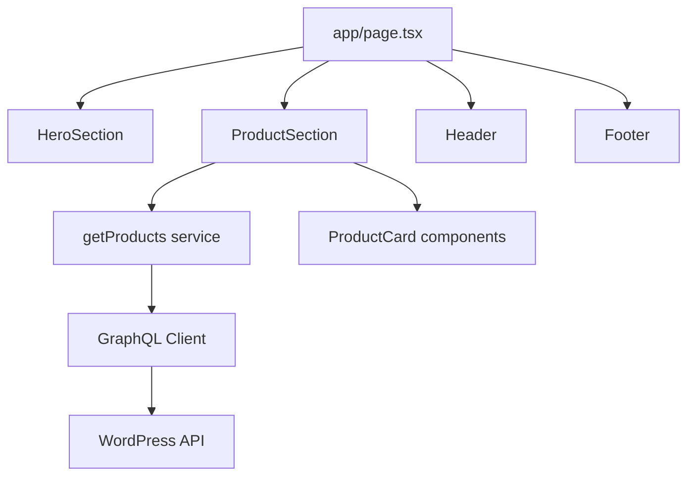

# Home Page Improvement Plan

## Overview

This plan focuses specifically on improving the home page ([`app/page.tsx`](app/page.tsx:1)) of the SAK WoodWorks application. The improvements will establish a foundation that can be extended to other pages.

## Current Home Page Analysis

### Existing Structure
The current home page ([`app/page.tsx`](app/page.tsx:1)) contains:
- Inline GraphQL query for fetching products
- Hardcoded API endpoint (`http://sak_wp:80/graphql`)
- Mixed data fetching and UI logic
- No TypeScript types (using `any`)
- No loading states
- Basic error handling
- No reusable components

### Sections Present
1. Hero section with title, description, and CTA button
2. Product grid showing latest 6 products
3. Error state for API failures

## Proposed Home Page Architecture

### New File Structure (Home Page Focused)

```
frontend/
├── app/
│   ├── layout.tsx (root layout - add header/footer)
│   ├── page.tsx (refactored home page)
│   └── globals.css
├── components/
│   ├── ui/
│   │   ├── Button.tsx (reusable button component)
│   │   ├── Card.tsx (base card component)
│   │   ├── ProductCard.tsx (product display card)
│   │   └── Skeleton.tsx (loading skeleton)
│   ├── layout/
│   │   ├── Header.tsx (navigation header)
│   │   └── Footer.tsx (site footer)
│   └── home/
│       ├── HeroSection.tsx (hero banner)
│       └── ProductSection.tsx (products grid)
├── lib/
│   ├── config/
│   │   └── constants.ts (API endpoints, app constants)
│   ├── graphql/
│   │   ├── client.ts (GraphQL fetch wrapper)
│   │   └── queries.ts (GraphQL queries)
│   └── types/
│       ├── product.ts (product type definitions)
│       └── index.ts (type exports)
├── .env.local
├── .env.example
└── next.config.ts
```

### Home Page Flow Diagram



## Implementation Steps

### Step 1: Environment & Configuration

**Create `.env.example`**
```env
# WordPress GraphQL API
NEXT_PUBLIC_WORDPRESS_API_URL=http://sak_wp:80/graphql

# App Configuration
NEXT_PUBLIC_APP_NAME=SAK WoodWorks
NEXT_PUBLIC_APP_DESCRIPTION=Premium Construction Materials

# Feature Flags
NEXT_PUBLIC_ENABLE_CART=true
```

**Create `.env.local`** (same structure with actual values)

**Create `lib/config/constants.ts`**
```typescript
export const API_CONFIG = {
  endpoint: process.env.NEXT_PUBLIC_WORDPRESS_API_URL || 'http://sak_wp:80/graphql',
  cache: 'no-store' as RequestCache,
};

export const APP_CONFIG = {
  name: process.env.NEXT_PUBLIC_APP_NAME || 'SAK WoodWorks',
  description: process.env.NEXT_PUBLIC_APP_DESCRIPTION || 'Premium Construction Materials',
  productsPerPage: 6,
};
```

### Step 2: TypeScript Types

**Create `lib/types/product.ts`**
```typescript
export interface ProductImage {
  sourceUrl: string;
  altText?: string;
}

export interface SimpleProduct {
  price: string;
  regularPrice?: string;
}

export interface Product {
  id: string;
  name: string;
  slug: string;
  image?: ProductImage;
  price?: string;
  regularPrice?: string;
  description?: string;
}

export interface ProductsResponse {
  products: {
    nodes: Product[];
  };
}

export interface ProductResponse {
  product: Product | null;
}
```

**Create `lib/types/index.ts`**
```typescript
export * from './product';
```

### Step 3: GraphQL Layer

**Create `lib/graphql/client.ts`**
```typescript
import { API_CONFIG } from '@/lib/config/constants';

export async function graphqlRequest<T>(
  query: string,
  variables?: Record<string, any>
): Promise<T | null> {
  try {
    const res = await fetch(API_CONFIG.endpoint, {
      method: 'POST',
      headers: { 'Content-Type': 'application/json' },
      body: JSON.stringify({ query, variables }),
      cache: API_CONFIG.cache,
    });

    if (!res.ok) {
      throw new Error(`HTTP error! status: ${res.status}`);
    }

    const json = await res.json();
    return json.data;
  } catch (error) {
    console.error('GraphQL request failed:', error);
    return null;
  }
}
```

**Create `lib/graphql/queries.ts`**
```typescript
import { ProductsResponse, ProductResponse } from '@/lib/types';

export const GET_PRODUCTS_QUERY = `
  query GetProducts($first: Int) {
    products(first: $first) {
      nodes {
        id
        name
        slug
        image {
          sourceUrl
        }
        ... on SimpleProduct {
          price
          regularPrice
        }
      }
    }
  }
`;

export const GET_PRODUCT_QUERY = `
  query GetProduct($slug: ID!) {
    product(id: $slug, idType: SLUG) {
      name
      description
      image {
        sourceUrl
      }
      ... on SimpleProduct {
        price
        regularPrice
      }
    }
  }
`;
```

### Step 4: Data Service Layer

**Create `lib/services/productService.ts`**
```typescript
import { graphqlRequest } from '@/lib/graphql/client';
import { GET_PRODUCTS_QUERY, GET_PRODUCT_QUERY } from '@/lib/graphql/queries';
import { Product, ProductsResponse, ProductResponse } from '@/lib/types';
import { APP_CONFIG } from '@/lib/config/constants';

export async function getProducts(): Promise<Product[]> {
  const data = await graphqlRequest<ProductsResponse>(GET_PRODUCTS_QUERY, {
    first: APP_CONFIG.productsPerPage,
  });
  return data?.products?.nodes || [];
}

export async function getProductBySlug(slug: string): Promise<Product | null> {
  const data = await graphqlRequest<ProductResponse>(GET_PRODUCT_QUERY, { slug });
  return data?.product || null;
}
```

### Step 5: UI Components

**Create `components/ui/Button.tsx`**
```typescript
import { ButtonHTMLAttributes } from 'react';

interface ButtonProps extends ButtonHTMLAttributes<HTMLButtonElement> {
  variant?: 'primary' | 'secondary';
  fullWidth?: boolean;
}

export function Button({ 
  variant = 'primary', 
  fullWidth = false,
  className = '',
  children,
  ...props 
}: ButtonProps) {
  const baseStyles = 'font-bold px-8 py-3 rounded transition shadow-lg';
  const variants = {
    primary: 'bg-amber-500 text-white hover:bg-amber-600',
    secondary: 'bg-white text-amber-700 hover:bg-gray-100',
  };
  const widthClass = fullWidth ? 'w-full' : '';

  return (
    <button
      className={`${baseStyles} ${variants[variant]} ${widthClass} ${className}`}
      {...props}
    >
      {children}
    </button>
  );
}
```

**Create `components/ui/ProductCard.tsx`**
```typescript
import Link from 'next/link';
import { Product } from '@/lib/types';

interface ProductCardProps {
  product: Product;
}

export function ProductCard({ product }: ProductCardProps) {
  return (
    <Link href={`/products/${product.slug}`} className="block">
      <div className="bg-white rounded-lg shadow-md overflow-hidden hover:shadow-xl transition duration-300 h-full">
        {/* Image Area */}
        <div className="h-64 bg-gray-200 relative overflow-hidden group">
          {product.image?.sourceUrl ? (
            
          ) : (
            <div className="flex items-center justify-center h-full text-gray-400">
              No Image Available
            </div>
          )}
        </div>

        {/* Text Area */}
        <div className="p-5">
          <h3 className="font-bold text-xl text-gray-800 mb-2 truncate">
            {product.name}
          </h3>
          <div className="text-amber-700 font-bold text-lg">
            {product.price || "Contact for Price"}
          </div>
        </div>
      </div>
    </Link>
  );
}
```

**Create `components/ui/Skeleton.tsx`**
```typescript
export function ProductCardSkeleton() {
  return (
    <div className="bg-white rounded-lg shadow-md overflow-hidden">
      <div className="h-64 bg-gray-200 animate-pulse" />
      <div className="p-5">
        <div className="h-6 bg-gray-200 rounded mb-2 animate-pulse" />
        <div className="h-5 bg-gray-200 rounded w-1/2 animate-pulse" />
      </div>
    </div>
  );
}
```

### Step 6: Layout Components

**Create `components/layout/Header.tsx`**
```typescript
import Link from 'next/link';
import { APP_CONFIG } from '@/lib/config/constants';

export function Header() {
  return (
    <header className="bg-white shadow-sm">
      <div className="max-w-6xl mx-auto px-6 py-4 flex justify-between items-center">
        <Link href="/" className="text-2xl font-bold text-[#5C4033]">
          {APP_CONFIG.name}
        </Link>
        <nav className="flex gap-6">
          <Link href="/" className="text-gray-700 hover:text-amber-600 transition">
            Home
          </Link>
          <Link href="/products" className="text-gray-700 hover:text-amber-600 transition">
            Products
          </Link>
        </nav>
      </div>
    </header>
  );
}
```

**Create `components/layout/Footer.tsx`**
```typescript
import { APP_CONFIG } from '@/lib/config/constants';

export function Footer() {
  return (
    <footer className="bg-[#5C4033] text-white py-8">
      <div className="max-w-6xl mx-auto px-6 text-center">
        <p className="text-amber-100">{APP_CONFIG.name}</p>
        <p className="text-sm text-amber-200 mt-2">
          {APP_CONFIG.description}
        </p>
      </div>
    </footer>
  );
}
```

### Step 7: Home Page Components

**Create `components/home/HeroSection.tsx`**
```typescript
import { Button } from '@/components/ui/Button';
import { APP_CONFIG } from '@/lib/config/constants';

export function HeroSection() {
  return (
    <section className="bg-[#5C4033] text-white py-24 px-6 text-center">
      <h1 className="text-4xl md:text-6xl font-bold mb-4 tracking-tight">
        {APP_CONFIG.name}
      </h1>
      <p className="text-lg md:text-xl text-amber-100 mb-8 max-w-2xl mx-auto">
        {APP_CONFIG.description}
      </p>
      <Button>Browse Catalog</Button>
    </section>
  );
}
```

**Create `components/home/ProductSection.tsx`**
```typescript
import { ProductCard, ProductCardSkeleton } from '@/components/ui';
import { getProducts } from '@/lib/services/productService';

export async function ProductSection() {
  const products = await getProducts();

  return (
    <section className="max-w-6xl mx-auto py-16 px-6">
      <h2 className="text-3xl font-bold text-gray-800 mb-8 border-l-8 border-amber-600 pl-4">
        Latest Products
      </h2>

      {products.length > 0 ? (
        <div className="grid grid-cols-1 md:grid-cols-3 gap-8">
          {products.map((product) => (
            <ProductCard key={product.id} product={product} />
          ))}
        </div>
      ) : (
        <div className="bg-white p-8 rounded-lg shadow border border-red-100 text-center">
          <p className="text-red-500 font-bold text-xl">Connection to WordPress Failed</p>
          <p className="text-gray-600 mt-2">
            Make sure your plugin <strong>WPGraphQL WooCommerce</strong> is installed and activated.
          </p>
        </div>
      )}
    </section>
  );
}
```

### Step 8: Update Root Layout

**Update `app/layout.tsx`**
```typescript
import type { Metadata } from "next";
import { Geist, Geist_Mono } from "next/font/google";
import { Header } from "@/components/layout/Header";
import { Footer } from "@/components/layout/Footer";
import "./globals.css";

const geistSans = Geist({
  variable: "--font-geist-sans",
  subsets: ["latin"],
});

const geistMono = Geist_Mono({
  variable: "--font-geist-mono",
  subsets: ["latin"],
});

export const metadata: Metadata = {
  title: "SAK WoodWorks - Premium Construction Materials",
  description: "Premium Construction Materials, Timber, and Plywood directly from the factory.",
};

export default function RootLayout({
  children,
}: Readonly<{
  children: React.ReactNode;
}>) {
  return (
    <html lang="en">
      <body
        className={`${geistSans.variable} ${geistMono.variable} antialiased`}
      >
        <Header />
        <main className="min-h-screen bg-gray-50 font-sans">
          {children}
        </main>
        <Footer />
      </body>
    </html>
  );
}
```

### Step 9: Refactor Home Page

**Update `app/page.tsx`**
```typescript
import { HeroSection } from '@/components/home/HeroSection';
import { ProductSection } from '@/components/home/ProductSection';

export default async function HomePage() {
  return (
    <>
      <HeroSection />
      <ProductSection />
    </>
  );
}
```

### Step 10: Configure Next.js for Images

**Update `next.config.ts`**
```typescript
import type { NextConfig } from "next";

const nextConfig: NextConfig = {
  images: {
    remotePatterns: [
      {
        protocol: 'http',
        hostname: 'sak_wp',
        port: '80',
        pathname: '/**',
      },
    ],
  },
};

export default nextConfig;
```

## Benefits of This Approach

1. **Separation of Concerns** - Data fetching, UI, and configuration are separated
2. **Type Safety** - Full TypeScript coverage with proper interfaces
3. **Reusability** - Components can be used across the application
4. **Maintainability** - Clear file structure and single responsibility
5. **Testability** - Services and components can be tested independently
6. **Scalability** - Easy to extend to other pages

## Implementation Order

1. Environment & Configuration
2. TypeScript Types
3. GraphQL Layer
4. Data Service Layer
5. UI Components
6. Layout Components
7. Home Page Components
8. Update Root Layout
9. Refactor Home Page
10. Configure Next.js
